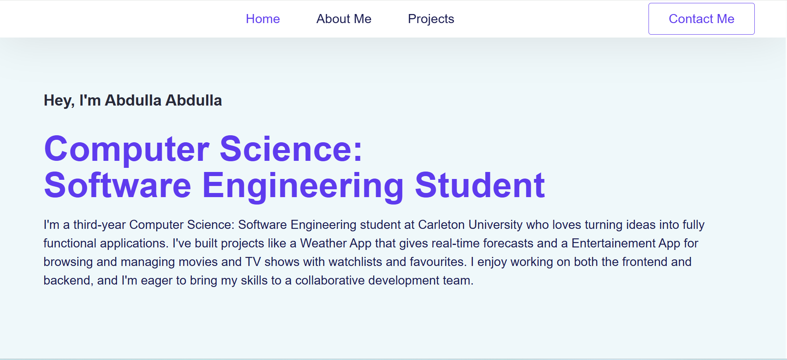
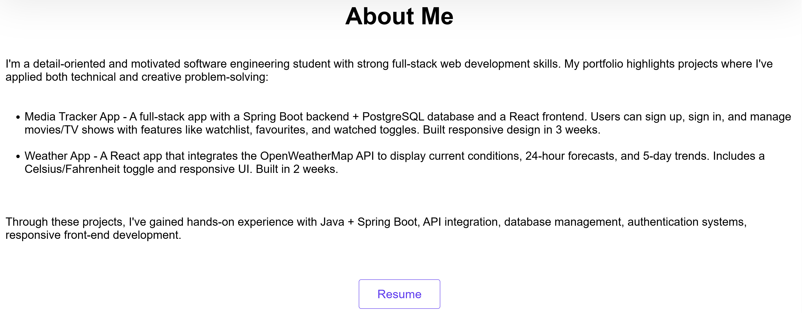
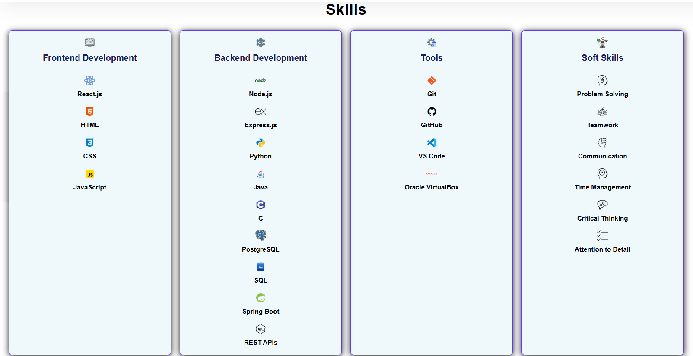
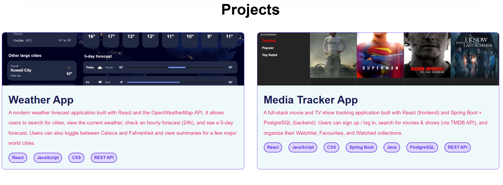
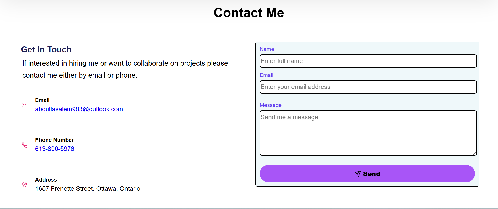

# 🌐 Personal Portfolio Website

A modern, responsive portfolio built with **React, Node.js, and Express**.  
It showcases my projects, skills, and provides an easy way to contact me.

---

## 🚀 Live Demo
🔗 Frontend: [View Portfolio Live](https://portfolio-project-alpha-teal.vercel.app/)
🔗 Backend API: [Portfolio API](https://portfolio-project-jrxv.onrender.com)
---

## 🛠️ Tech Stack
- **Frontend:** React, React Router, CSS  
- **Backend:** Node.js, Express  
- **Deployment:** Vercel (Frontend), Render/Heroku (Backend)

---

## 📸 Screenshots

| Home | About Me | Skills | Projects | Contact |
|---|---|---|---|---|
|  |  |  |  |  |
---

## ⚙️ Run Locally

```bash
# Clone repo
git clone https://github.com/abdullaabdulla97/portfolio-project.git
cd portfolio-project

# Install dependencies
npm install

# Start backend server
node server.js

# Start frontend (in another terminal)
npm start
```

---

## 📬 Contact
- 💼 LinkedIn: [LinkedIn](https://www.linkedin.com/in/abdulla-abdulla-350a0937b/)  
- 📧 Email: abdulla.abdulla.salem97@gmail.com  
- 🐙 GitHub: [GitHub](https://github.com/abdullaabdulla97)

---